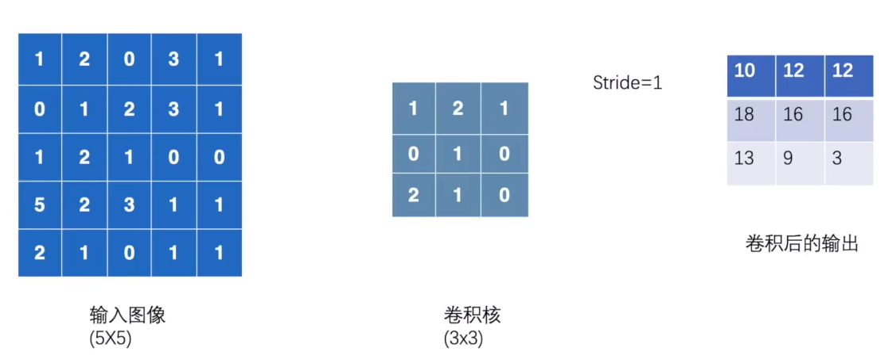
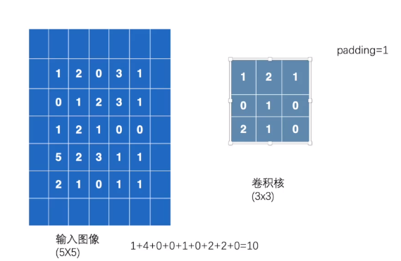
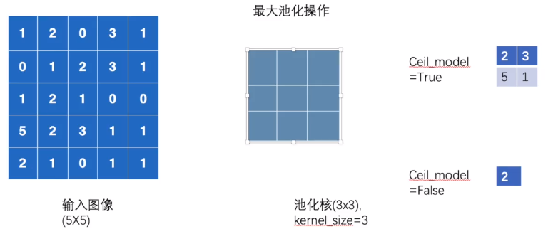
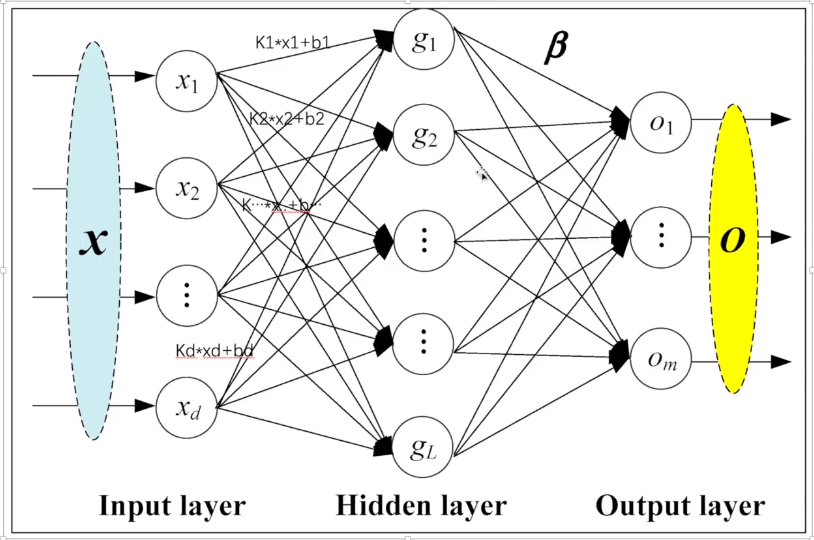
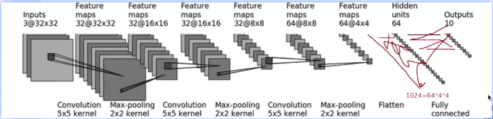

根据B站上土堆深度学习 Pytorch 入门课程的学习所敲代码，在代码行加入了注释以及
一小部分自己记录的笔记，具体内容的详细学习可以自己去学习网站搜索大佬发布的文字或视频教程。  
学到后面源代码文件太多所以新建了一个src文件，所以代码中有些路径部分可能会存在错误，注意修改。
另外，在运行每个代码需要使用tensorboard时，注意要把其已有的log文件夹全删除。  
由于我的电脑没有gpu，所以后期是使用的kaggle的免费gpu进行模型训练。
## nn_conv.py——Convolution卷积操作
conv2d为二维卷积操作，图片即为二维
Sride为步长，先横向移动再纵向移动，kernel与input对应数字相乘后相加得到output

Padding为填充，上下左右各填充几个像素，通常填充为0

## nn_maxpool.py——最大池化操作
移动之后取所有方格内的最大值，当移动到方格（像素）不足以完全覆盖池化核时，取决于Ceil_model是否为true

## nn_linear.py——线性层

## nn_seq.py——sequential神经网络搭建

